Problem 1: Clustering and PCA
-----------------------------

### Data Wrangling

To begin, I made a few plots to see if clear clusters are present in the
data in terms of color and quality.

#### Color

As shown in the plots below, there seem to be relatively clear clusters
for the two colors. The more distinct clusters are observed in the plots
of total sulfur dioxide vs. fixed acidity, and total sulfur dioxide
vs. chlorides, suggesting that these features play a vital roles in
determining the color of the wine.

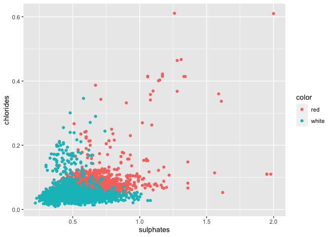

#### Quality

On the other hand, the quality clusters are not easily distinguishable
as seen below. The most distinct clustering is observed in the alcohol
vs. sulphates plot, which is not very distinct. The rest of the plots
reflect that clear clustering is not observed for quality in the
observed feature space.

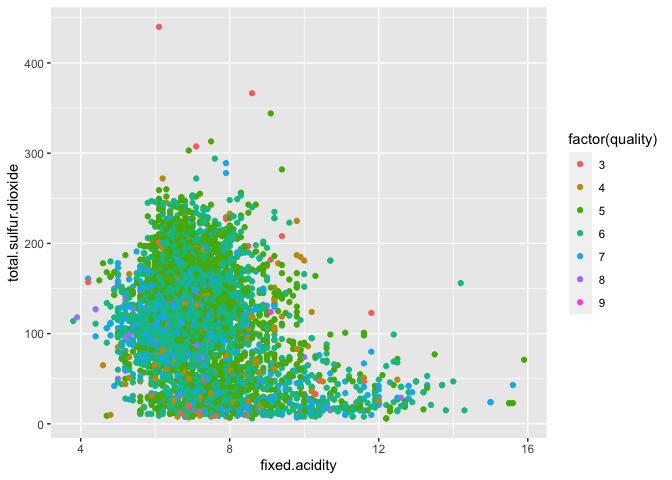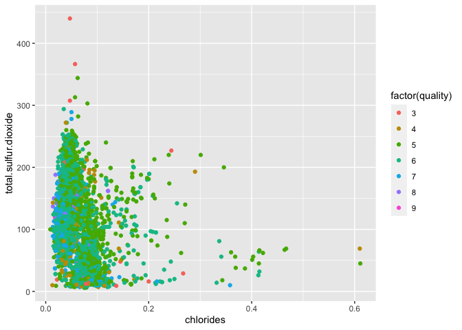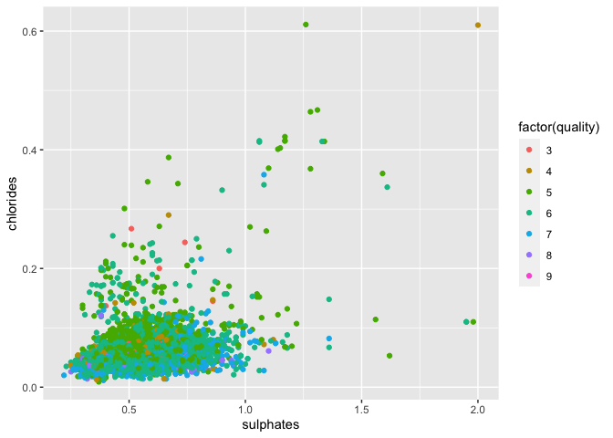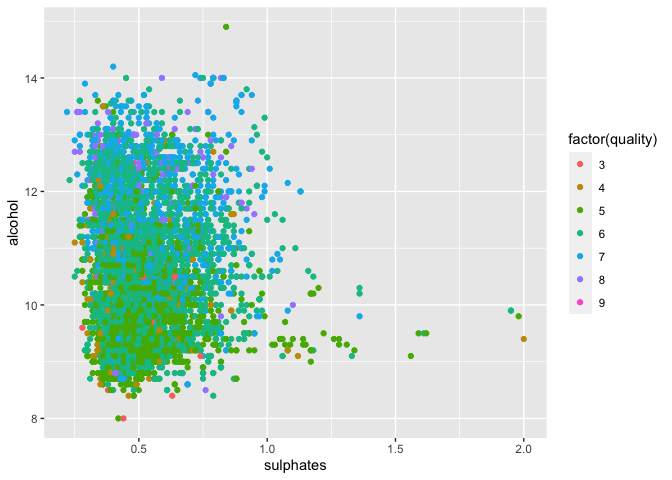

### Clustering: kmeans++

#### Choosing k

After observing the patterns in the data, I decided to peform kmeans++
clustering after scaling the 11 features. To choose the optimal k, I
plotted the Total Within Sum of Square against the number of clusters.
Since it is not very obvious that which value of k would be “optimal”, I
decided to test three different values of k from the plot i.e. 2, 3, and
7. I chose 2 becuase it is known that we have two clusters for coloring,
which was also obvious in the data wrangling plots above. I chose 3 as
the Total Within Sum of Squares plot seems to settle down beyond this
point. Lastly, I chose 7 as it seemed to have the most relatively stable
Total Within Sum of Square value in the plot below, and there are 7 wine
quality types.

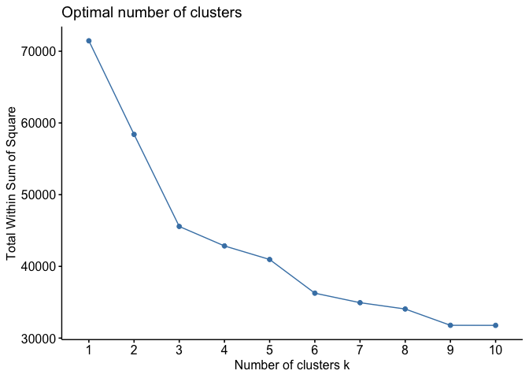

#### Testing clustering performance: Rand Index

I decided to test the clustering performance based on the Rand Index for
the clusters for each value of k, and the actual color and quality
labels. The Rand Index measures the similarity of points between two
clusters. The calculated values for each k, against actual color and
quality are shown below. It can be seen that for color, k=2 performed
the best as it has the highest Rand Index of 0.972, which is quite high
as the Rand Index ranges from 0 to 1, with higher values reflecting
higher similairities between clusters. As for quality, k=7 resulted in
the highest Rand Index of 0.625. Although, it is the highest among the
three, it is not high enough as there are only 62% similarities between
the actual quality clusters and the kmeans++ clusters.

    ## [1] "Rand Index for color"

    ## Rand Index for k=2: 0.972076

    ## Rand Index for k=3: 0.7060475

    ## Rand Index for k=7: 0.5332443

    ## [1] "Rand Index for quality"

    ## Rand Index for k=2: 0.4596687

    ## Rand Index for k=3: 0.5563423

    ## Rand Index for k=7: 0.6254747

I thought it would be insightful to observe the feature differences
between the two clusters for k=2. It seems like the two colors mainly
differ in terms of free sulfur dioxide, total sulfure dioxide, and
residual sugar.

#### Cluster 1

    ##        fixed.acidity     volatile.acidity          citric.acid 
    ##                  6.9                  0.3                  0.3 
    ##       residual.sugar            chlorides  free.sulfur.dioxide 
    ##                  6.4                  0.0                 35.5 
    ## total.sulfur.dioxide              density                   pH 
    ##                138.5                  1.0                  3.2 
    ##            sulphates              alcohol 
    ##                  0.5                 10.5

#### Cluster 2

    ##        fixed.acidity     volatile.acidity          citric.acid 
    ##                  8.3                  0.5                  0.3 
    ##       residual.sugar            chlorides  free.sulfur.dioxide 
    ##                  2.6                  0.1                 15.8 
    ## total.sulfur.dioxide              density                   pH 
    ##                 48.6                  1.0                  3.3 
    ##            sulphates              alcohol 
    ##                  0.7                 10.4

#### Plots for k=2 (color)

To perform a visual test on cluster similarity between kmeans++ and the
actual color cluster, I plotted the same plots from the wrangling
section using the k=2 clusters. It can be seen that the plots are almost
identical, which confirms that kmeans++ with k=2 is the ideal choice for
distinguishing red wines from white wines.

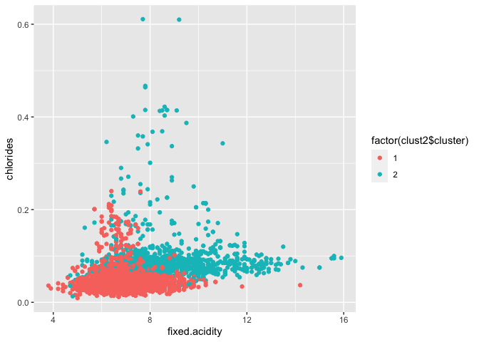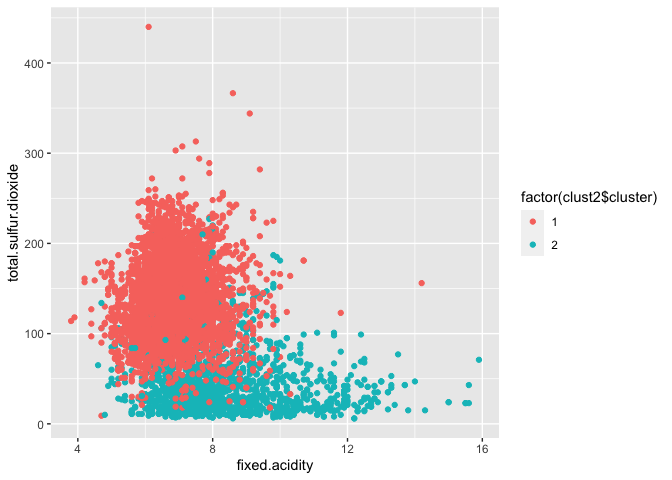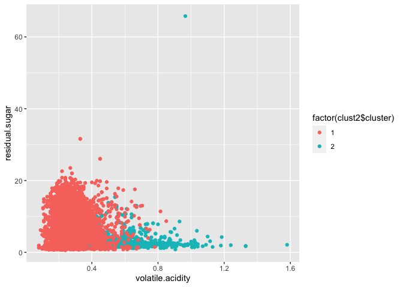

#### Plots for k=7 (quality)

Likewise, I plotted the same plots from the wrangling section to test
the similarities between the kmeans++ clusters and the actual quality
clusters. It can be seen that the plots barely compare, therefore, as
suggested by the Rand Index, kmeans++ is not an ideal candidate for
distinguishing quality.

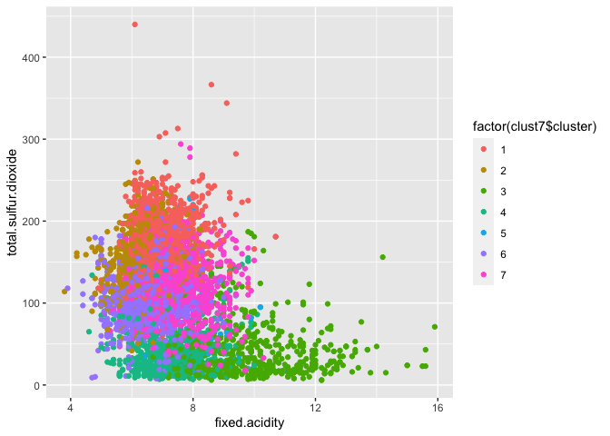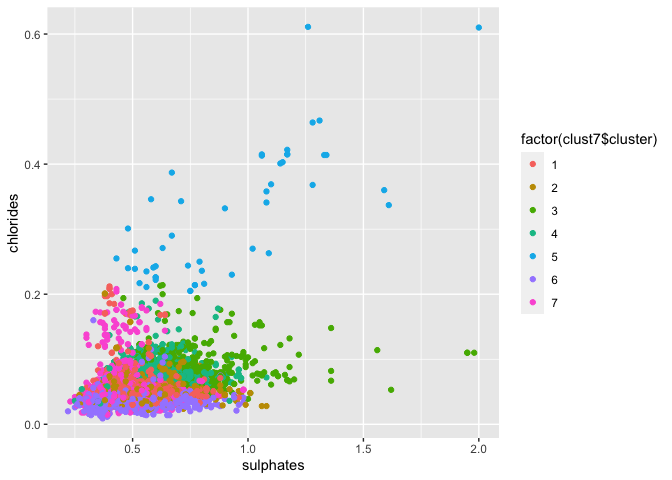

### Prinicpal Component Analysis (PCA)

The next technique utilized to distinguish color and quality is the
Principal Component Analysis. I began by scaling the features. To choose
the number of components, I plotted the Proportion of Variance Explained
and the Cumulative Proportion of Variance Explained by each component. I
tested out three values for the number of components i.e. 2, 6, and 8. I
chose 2 for the same reasons I chose k=2 in kmeans++. I chose 6 and 8,
since they capture at least 80% and 90% of the variance, respectively.

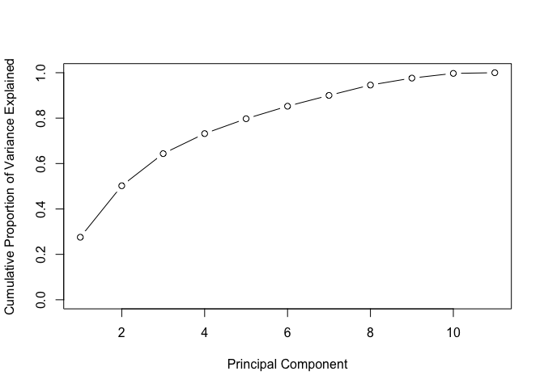

#### Testing PCA performance: Rand Index

I used the Rand Index to evaluate the three different ranks for color
and quality.

#### PCA with rank=2

    ## [1] "Rand Index for color"

    ## RI for component 1: 0.5395817

    ## RI for component 2: 0.4242663

    ## [1] "Rand Index for quality"

    ## RI for component 1: 0.613434

    ## RI for component 2: 0.6236574

#### PCA with rank=6

    ## [1] "Rand Index for color"

    ## RI for component 1: 0.5395817

    ## RI for component 2: 0.4242663

    ## RI for component 3: 0.4709371

    ## RI for component 4: 0.452791

    ## RI for component 5: 0.4798587

    ## RI for component 6: 0.4609853

    ## [1] "Rand Index for quality"

    ## RI for component 1: 0.613434

    ## RI for component 2: 0.6236574

    ## RI for component 3: 0.5989959

    ## RI for component 4: 0.5781817

    ## RI for component 5: 0.5440188

    ## RI for component 6: 0.5570515

#### PCA with rank=8

    ## [1] "Rand Index for color"

    ## RI for component 1: 0.5395817

    ## RI for component 2: 0.4242663

    ## RI for component 3: 0.4709371

    ## RI for component 4: 0.452791

    ## RI for component 5: 0.4798587

    ## RI for component 6: 0.4609853

    ## RI for component 7: 0.475365

    ## RI for component 8: 0.4790563

    ## [1] "Rand Index for quality"

    ## RI for component 1: 0.613434

    ## RI for component 2: 0.6236574

    ## RI for component 3: 0.5989959

    ## RI for component 4: 0.5781817

    ## RI for component 5: 0.5440188

    ## RI for component 6: 0.5570515

    ## RI for component 7: 0.5450278

    ## RI for component 8: 0.5387435

It can be seen that none of the ranks perform as good as kmeans++ in
terms of color which has a Rand Index of 0.972, whereas the highest Rand
Index for color among all of the PCA ranks is only 0.54. As for quality,
the PCA performs the same as kmeans++ across all ranks, with the highest
Rand Index for quality being 0.624. As seen in the kmeans++ section, the
highest Rand Index achieved for k=7 was 0.625. Therefore, neither
kmeans++ nor PCA were able to distinguish quality very well. This could
possibly be attributed to the lack of distinct clustering in the
original data in terms of quality.

#### PCA plots for rank 2

Although, PCA did not perform as well as kmeans++ in terms of
distinguishing colors, the plots below show that the color clusters are
much more distinct than the quality clusters. The biplot below shows
details about the two components. It is clear that PC1 has higher
weights for free sulphur dioxide, total sulfur dioxide, and residual
sugar, which were also the features that distinguised color in kmeans++.

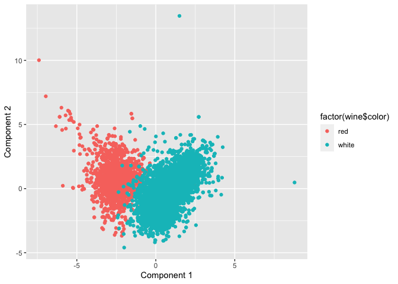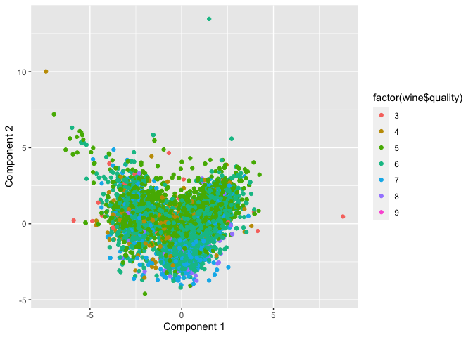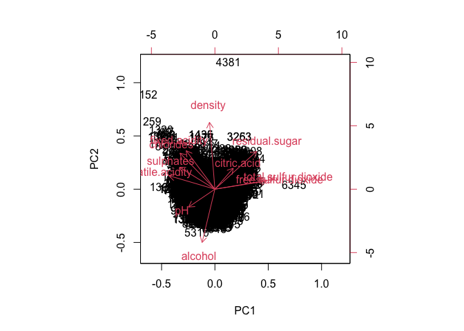

Problem 2: Market Segmentation
------------------------------

Firstly, I observed the distibution of the categorical features by
constructing box plots of each feature. I noticed that spam and adult
were mostly outliers. Furthermore, spam and adult users would not be the
ideal target market for the drink, therfore, I deemed it fit to remove
these two features from the analysis.

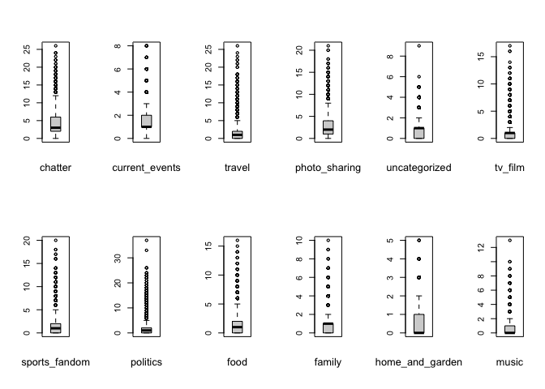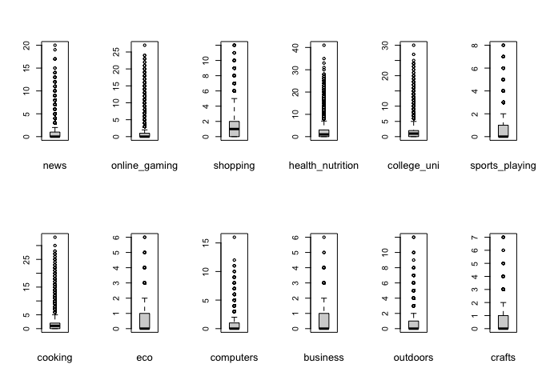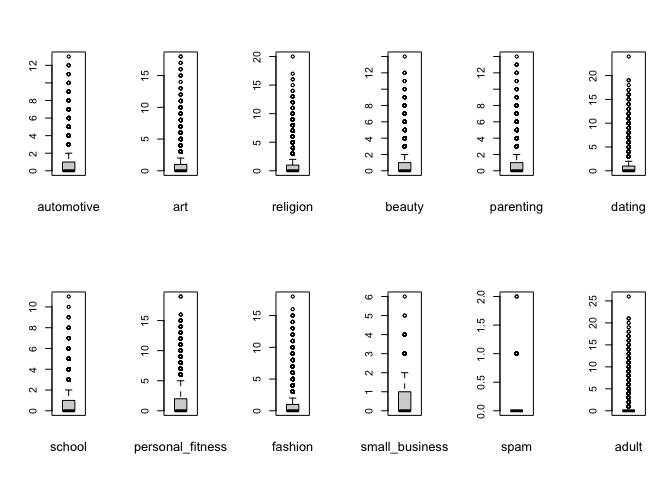

### kmeans++

The first technique utilized is kmeans++ clustering. I scaled the
categorical features and plotted the Total Within Sum of Squares against
k to get a range of optimal k. As seen below, k ranges from 2 to 10,
therefore I created a function to test the optimal value of k based on
the Silhoutte score. The Silhouette score measures the goodness of
clustering, and ranges from -1 to 1. 1: Means clusters are well apart
from each other and clearly distinguished. 0: Means clusters are
indifferent. -1: Means clusters are assigned in the wrong way.

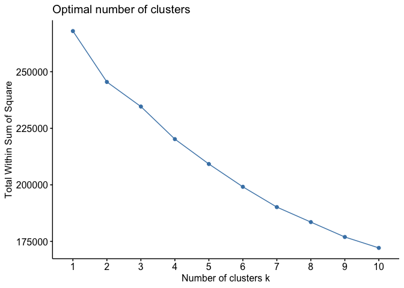

I plotted the Average Silhoutte score for k between 2 and 10. It can be
seen that k=2 and k=3 result in the two highest Silhouette scores.

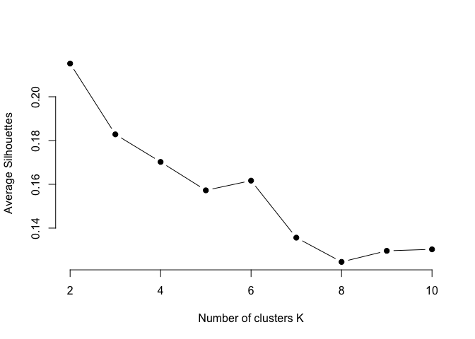

The exact scores for k=2 and k=3 are displayed below. Since the two
scores are not significantly different, I decided to use k=3 since 3
clusters will result in a little more distcintion amongst the customer
segments.

    ## The average silhouette score for k=2: 0.2151791

    ## The average silhouette score for k=3: 0.1828174

I examined the summary of the average values for each feature within a cluster. 
The three clusters could be seen as three different
market segments. All segments seem to be interested in the following
topics: chatter, current events, travel, photo sharing, tv film, sports
fandom, politics, food, news, online gaming, shopping, health nutrition,
college uni, cooking, automotive, and personal fitness.

Cluster/Segment 1 seems to be interested in all of the general topics
mentioned above but at a much more moderate rate than the other
segments.

Cluster/Segment 2 leans heavily towards sports fandom, food, family,
home and garden, parenting, school, crafts, and religion. Therefore, it
is reasonable to conclude that this segement represents family-oriented
customers, who also care about health and nutrition.

Cluster/Segment 3 leans heavily towards chatter, travel, photo sharing,
tv film, politics, music, online gaming, shopping, health nutrition,
college uni, sports playing, cooking, computers, outdoors, automotive,
art, beauty, dating, personal fitness, fashion. Therefore, it can be
concluded that this segment represents single, young, and possibly
college-attending customers.

The topics that were not as popular among all the segments include, home
garden, eco, business, small business. This could mean that the
customers not very business or environment oriented althought some of
them show interest in these topics.

Since health nutrition, and personal fitness are directly relatable to
NutrientH20, and are topics with a shared interest amongst all segments,
the company could focus heavily on these two topics. Sports fandom,
online gaming and travel seem to be widely shared interests as well, so
focusing on these topics could appeal to the whole audience. If the
company is intersted in targeting niche groups, they can focus on
family-oriented topics and/or single, yound adults.

Although, the Silhouette score is positive for k=3, it is not as high
for a great clustering technique.

### Hierarchical clustering: Ward clustering

The second technique I tried is Hierarchical clustering. I tested all
the methods, including complete, ward, single, and average for k=5. I
chose the method that resulted in the most balanced clusters. As seen
below, method=ward led to the most balanced clusters, therefore, I chose
the ward clustering technique.

    ## Cluster balance for method=complete

    ##    1    2    3    4    5 
    ## 7170  282  408   11   11

    ## Cluster balance for method=ward

    ##    1    2    3    4    5 
    ##  962 1056 1691 3138 1035

    ## Cluster balance for method=single

    ##    1    2    3    4    5 
    ## 7878    1    1    1    1

    ## Cluster balance for method=average

    ##    1    2    3    4    5 
    ## 7867    3    4    7    1

#### Choose k

I used the same method as used above in kmeans++ to find the k with the
highest Silhoutte score. It can be seen that the highest Silhoutte score
is achieved when k=6. However, the y-axis only goes as high as 0.06,
which shows that this method performs worse than kmeans++ based on the
Silhoutte score.

I did not explore this technique any further since the average Silhoutte
score is so much lower than that of the kmeans++. 

    ## Average silhouette score of kmeans++ with k=2: 0.2151791

    ## Average silhouette score of ward clustering with k=6: 0.06463974

Problem 3: Association rules for grocery purchases
--------------------------------------------------

I chose the following parameters: support = 0.001, and confidence = 0.5.
Since support measures how frequently an itemset is in all the
transactions, I wanted to consider the itemsets which occur at least 10
times out of a total of 9835 transactions, therefore, I set the support
equal to 0.001. I chose a high confidence measure because I wanted to
observe itemsets with higher conditional probabilities. Furthermore,
since Milk is a very frequent member, I thought having a combination of
low support and high confidence could account for the “monopolizing”
effect of Milk.

### A table of rules with lift greater than 10

I chose a high lift value to account for itemsets with a high confidence
value but weak association amongst items, such as, itemsets containing
milk and long life battery products. The table is arranged by lift in
descending order. All of these entries seem intuitive and appear to make
correct associations. Some entries are straightforward e.g. {baking
powder,flour} -&gt; {sugar} or {ham,processed cheese} -&gt; {white
bread}, such entries seem to be ingredients for a specific meal. While
other entries are more assorted, such as, {other
vegetables,rolls/buns,root vegetables,tropical fruit,whole milk}
-&gt;{beef} or {sliced cheese,tropical fruit,whole milk,yogurt} -&gt;
{butter}, these entries seem to be general grocery items that are needed
at all times in a household.

<table style="width:100%;">
<caption>Rules with lift greater than 10</caption>
<colgroup>
<col style="width: 53%" />
<col style="width: 12%" />
<col style="width: 7%" />
<col style="width: 8%" />
<col style="width: 7%" />
<col style="width: 6%" />
<col style="width: 4%" />
</colgroup>
<thead>
<tr class="header">
<th style="text-align: left;">LHS</th>
<th style="text-align: left;">RHS</th>
<th style="text-align: right;">support</th>
<th style="text-align: right;">confidence</th>
<th style="text-align: right;">coverage</th>
<th style="text-align: right;">lift</th>
<th style="text-align: right;">count</th>
</tr>
</thead>
<tbody>
<tr class="odd">
<td style="text-align: left;">{Instant food products,soda}</td>
<td style="text-align: left;">{hamburger meat}</td>
<td style="text-align: right;">0.0012199</td>
<td style="text-align: right;">0.6315789</td>
<td style="text-align: right;">0.0019315</td>
<td style="text-align: right;">18.99952</td>
<td style="text-align: right;">12</td>
</tr>
<tr class="even">
<td style="text-align: left;">{popcorn,soda}</td>
<td style="text-align: left;">{salty snack}</td>
<td style="text-align: right;">0.0012199</td>
<td style="text-align: right;">0.6315789</td>
<td style="text-align: right;">0.0019315</td>
<td style="text-align: right;">16.70119</td>
<td style="text-align: right;">12</td>
</tr>
<tr class="odd">
<td style="text-align: left;">{baking powder,flour}</td>
<td style="text-align: left;">{sugar}</td>
<td style="text-align: right;">0.0010166</td>
<td style="text-align: right;">0.5555556</td>
<td style="text-align: right;">0.0018298</td>
<td style="text-align: right;">16.41141</td>
<td style="text-align: right;">10</td>
</tr>
<tr class="even">
<td style="text-align: left;">{ham,processed cheese}</td>
<td style="text-align: left;">{white bread}</td>
<td style="text-align: right;">0.0019315</td>
<td style="text-align: right;">0.6333333</td>
<td style="text-align: right;">0.0030497</td>
<td style="text-align: right;">15.04855</td>
<td style="text-align: right;">19</td>
</tr>
<tr class="odd">
<td style="text-align: left;">{Instant food products,whole milk}</td>
<td style="text-align: left;">{hamburger meat}</td>
<td style="text-align: right;">0.0015249</td>
<td style="text-align: right;">0.5000000</td>
<td style="text-align: right;">0.0030497</td>
<td style="text-align: right;">15.04128</td>
<td style="text-align: right;">15</td>
</tr>
<tr class="even">
<td style="text-align: left;">{curd,other vegetables,whipped/sour cream,yogurt}</td>
<td style="text-align: left;">{cream cheese }</td>
<td style="text-align: right;">0.0010166</td>
<td style="text-align: right;">0.5882353</td>
<td style="text-align: right;">0.0017282</td>
<td style="text-align: right;">14.83710</td>
<td style="text-align: right;">10</td>
</tr>
<tr class="odd">
<td style="text-align: left;">{domestic eggs,processed cheese}</td>
<td style="text-align: left;">{white bread}</td>
<td style="text-align: right;">0.0011182</td>
<td style="text-align: right;">0.5238095</td>
<td style="text-align: right;">0.0021348</td>
<td style="text-align: right;">12.44617</td>
<td style="text-align: right;">11</td>
</tr>
<tr class="even">
<td style="text-align: left;">{other vegetables,tropical fruit,white bread,yogurt}</td>
<td style="text-align: left;">{butter}</td>
<td style="text-align: right;">0.0010166</td>
<td style="text-align: right;">0.6666667</td>
<td style="text-align: right;">0.0015249</td>
<td style="text-align: right;">12.03303</td>
<td style="text-align: right;">10</td>
</tr>
<tr class="odd">
<td style="text-align: left;">{hamburger meat,whipped/sour cream,yogurt}</td>
<td style="text-align: left;">{butter}</td>
<td style="text-align: right;">0.0010166</td>
<td style="text-align: right;">0.6250000</td>
<td style="text-align: right;">0.0016265</td>
<td style="text-align: right;">11.28096</td>
<td style="text-align: right;">10</td>
</tr>
<tr class="even">
<td style="text-align: left;">{domestic eggs,other vegetables,tropical fruit,whole milk,yogurt}</td>
<td style="text-align: left;">{butter}</td>
<td style="text-align: right;">0.0010166</td>
<td style="text-align: right;">0.6250000</td>
<td style="text-align: right;">0.0016265</td>
<td style="text-align: right;">11.28096</td>
<td style="text-align: right;">10</td>
</tr>
<tr class="odd">
<td style="text-align: left;">{liquor,red/blush wine}</td>
<td style="text-align: left;">{bottled beer}</td>
<td style="text-align: right;">0.0019315</td>
<td style="text-align: right;">0.9047619</td>
<td style="text-align: right;">0.0021348</td>
<td style="text-align: right;">11.23755</td>
<td style="text-align: right;">19</td>
</tr>
<tr class="even">
<td style="text-align: left;">{cream cheese ,other vegetables,whipped/sour cream,yogurt}</td>
<td style="text-align: left;">{curd}</td>
<td style="text-align: right;">0.0010166</td>
<td style="text-align: right;">0.5882353</td>
<td style="text-align: right;">0.0017282</td>
<td style="text-align: right;">11.04288</td>
<td style="text-align: right;">10</td>
</tr>
<tr class="odd">
<td style="text-align: left;">{hard cheese,whipped/sour cream,yogurt}</td>
<td style="text-align: left;">{butter}</td>
<td style="text-align: right;">0.0010166</td>
<td style="text-align: right;">0.5882353</td>
<td style="text-align: right;">0.0017282</td>
<td style="text-align: right;">10.61738</td>
<td style="text-align: right;">10</td>
</tr>
<tr class="even">
<td style="text-align: left;">{other vegetables,rolls/buns,root vegetables,tropical fruit,whole milk}</td>
<td style="text-align: left;">{beef}</td>
<td style="text-align: right;">0.0011182</td>
<td style="text-align: right;">0.5500000</td>
<td style="text-align: right;">0.0020331</td>
<td style="text-align: right;">10.48517</td>
<td style="text-align: right;">11</td>
</tr>
<tr class="odd">
<td style="text-align: left;">{sliced cheese,tropical fruit,whole milk,yogurt}</td>
<td style="text-align: left;">{butter}</td>
<td style="text-align: right;">0.0010166</td>
<td style="text-align: right;">0.5555556</td>
<td style="text-align: right;">0.0018298</td>
<td style="text-align: right;">10.02752</td>
<td style="text-align: right;">10</td>
</tr>
</tbody>
</table>

### Lift-support-confidence plot

Below is a lift vs. support plot colored by confidence. It can be seen
that lift is negatively correlated with support. Also, higher confidence
values are observed for higher lift.

### Confidence-support-order plot

Below is a confidence vs. support plot colored by order It can be seen
that confidence is negatively correlated with support.

### Gephi graph

Below is a gephi graph for the “Force Atlas” layout with the “NA” values
filtered out. The size of the labels is based on Degree, whereas the
color of the labels is partitioned by Modularity Class. The paritioing
seems intuitive for the most part with a few exceptions like roots
vegetables being separate from other vegetables.

